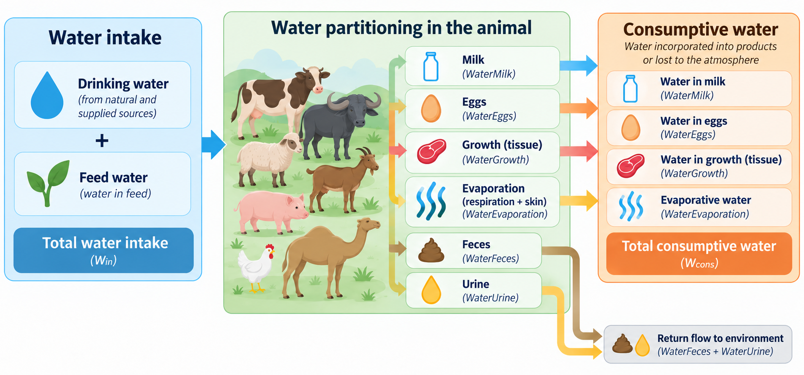

<h1 align="center">Livestock Water Partitioning (LiWaP)</h1>

<p align="center">
  
  
  
</p>

> [!TIP]
> The methodology underlying LiWaP has been submitted to a peer-reviewed scientific journal and is currently under review.

## What LiWaP does

LiWaP estimates the partitioning of water in livestock production systems at
the cohort level. It combines animal performance, ration characteristics,
temperature, lactation, egg production, and grazing information to calculate
water intake, water outputs, and consumptive water use.

| Water flow | What the model calculates |
| :-- | :-- |
| **Inputs** | Drinking water, feed water, and total water intake |
| **Product and growth outputs** | Water in milk, eggs, and live weight gain |
| **Excreted outputs** | Water in feces and urine |
| **Other outputs** | Evaporative water loss |
| **Final indicator** | Consumptive water use |

The model supports cattle (`CTL`), buffalo (`BFL`), sheep (`SHP`), goats
(`GTS`), pigs (`PGS`), camels (`CML`), and chickens (`CHK`).

<p align="center">
  
</p>

## Quick start

Install the latest version directly from GitHub:

```r
# Install devtools if needed
install.packages("devtools")

# Install LiWaP from GitHub
devtools::install_github("lydialanzoni/LiWaP-Livestock_Water_Partitioning_Model")
```

Load the package and run the model:

```r
library(data.table)
library(LiWaP)

# Supply a cohort-level input table containing the fields documented in ?run_liwap.
water_input_df <- fread("path/to/your_cohort_input.csv")

# Supply a water-output coefficient table with the fields documented in ?run_liwap.
water_output_df <- fread("path/to/your_water_output_parameters.csv")

water_results <- run_liwap(
  water_input_df = water_input_df,
  water_output_df = water_output_df
)
```

## Model outputs

`run_liwap()` returns the input cohort table with the following calculated
columns appended:

| Group | Output columns |
| :-- | :-- |
| **Offspring** | `MilkOffspring` |
| **Water intake** | `DrinkingWater`, `FeedWater`, `WaterIntake` |
| **Water partitioning** | `WaterFeces`, `WaterMilk`, `WaterEggs`, `WaterGrowth`, `WaterUrine`, `WaterEvaporation`, `WaterOutput` |
| **Water use** | `ConsumptiveWater` |

## Help and documentation

After installation, use standard R help pages to explore each function:

```r
?run_liwap
?calculate_milk_offspring
?calculate_water_intake
?calculate_water_outputs
?calculate_consumptive_water
```

## Project layout

```text
LiWaP/
|- R/                         Core calculations and model pipeline
|- Figures/                   Model figures and diagrams
|- Inputs/                    Water-output model coefficients
|- Outputs/                   Generated model results
|- man/                       Generated R help files
|- DESCRIPTION                Package metadata
`- README.md                  Project overview and quick start
```
